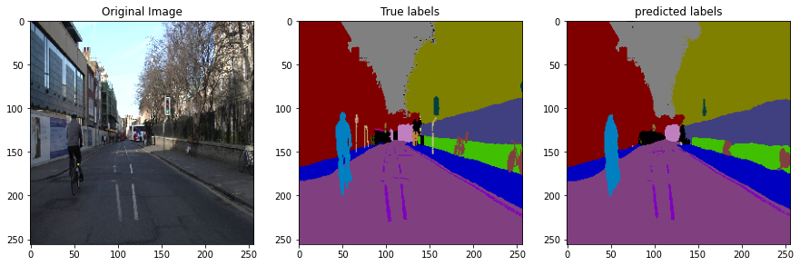

# welcome 
--------------------------------------------------------------------------------

  
 first, some logistics 

## Requirements

    Python 3.8
    Tensorflow 2.5
    tensorflow_addons
    openCV

## Cnn Architecture Implementation

    known cnn Architecture, implementet with tensorflow/keras 

* [GoogLeNet/InceptionV1](https://github.com/giladElichai/public/tree/main/CnnArchitecture/GoogLeNet_InceptionV1)
* [VGG](https://github.com/giladElichai/public/tree/main/CnnArchitecture/VGG)
* [ResNet](https://github.com/giladElichai/public/tree/main/CnnArchitecture/ResNet)
 

## Segmentation Architecture Implementation

    semantic segmentation project, implementet with tensorflow/keras 

* [SegNet](https://github.com/giladElichai/public/tree/main/segmentation/SEGNet)
* [UNet](https://github.com/giladElichai/public/tree/main/segmentation/UNET)
* [LinkNet](https://github.com/giladElichai/public/tree/main/segmentation/LinkNet)

## Object Detaction Architecture Implementation

    ObjectD etaction project, implementet with tensorflow/keras 

* [YoloV1](https://github.com/giladElichai/public/tree/main/ObjectDetaction/Yolov1)

## PaperImplementations

    Paper Implementations, implementet with tensorflow/keras     

* [Residual Attention](https://github.com/giladElichai/public/tree/main/PaperImplementations/ResidualAttention)

